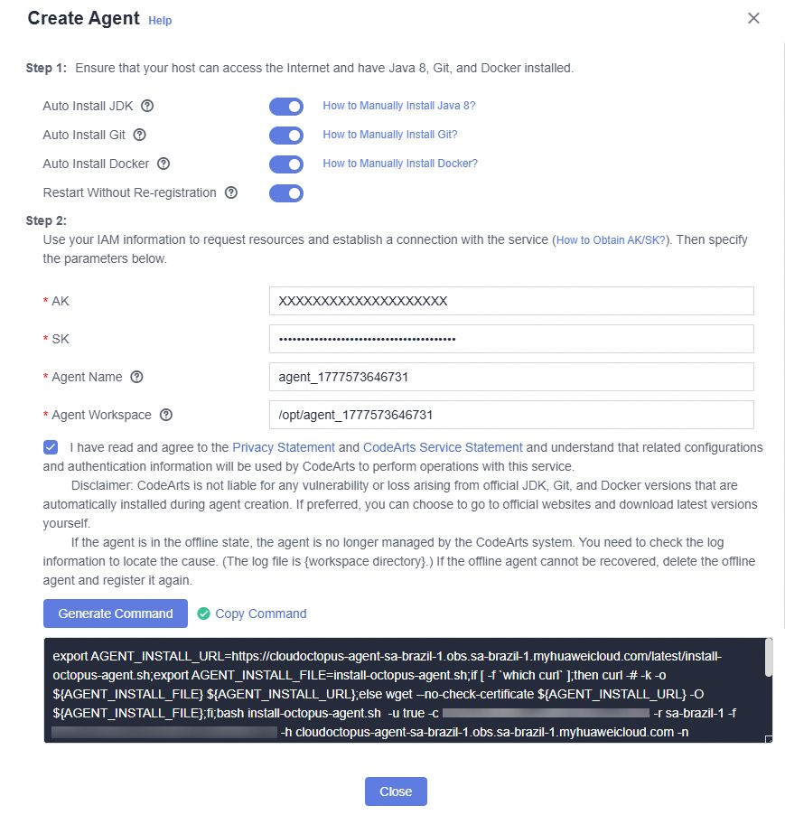
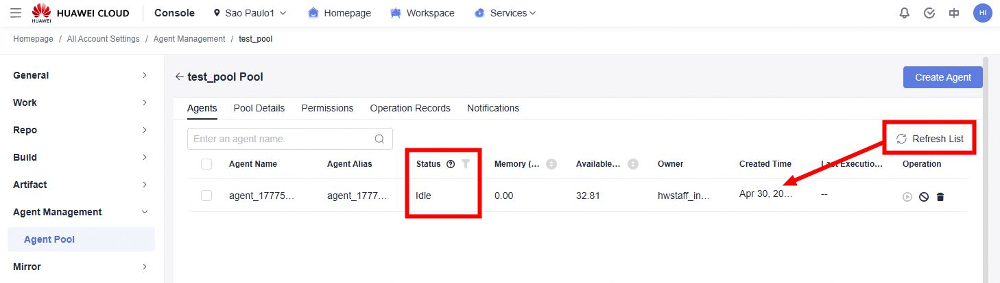

# Huawei Cloud IaC in CodeArts

This repository contains the code required to deploy a minimal structure to
implement an Infrastructure as Code (IaC) pipeline in Huawei Cloud CodeArts.

## Usage

### Infrastructure

First, create the resources using the code inside `tf_executor` folder.

Requirements:

- Terraform installed - <https://developer.hashicorp.com/terraform/downloads>

Follow the steps below inside `tf_executor` folder:

1. Make a copy of `terraform.tfvars.example` named `terraform.tfvars` and
   set AK, SK and passwords;
2. Run `terraform init` the first time to download provider files;
3. Run `terraform plan` to check what will be done;
4. Run `terraform apply` to provision the infrastructure.

### Demo infrastructure

The `tf_demo` folder contains Terraform code for a simple cloud infrastructure
that can be deployed in multiple accounts.

Instead of running Terraform commands directly, run the two Python scripts as
follows:

```sh
# 1. Prepare the Terraform code:
# - $BUCKET_NAME is the OBS bucket where Terraform state files are stored
# - $ACCOUNT_NAME is the account name where the resources will be deployed
python3 PrepareVariables.py -b $BUCKET_NAME -a $ACCOUNT_NAME

# 2. Run Terraform:
# - $ACTION can be plan, apply, plan_destroy (plan -destroy) or destroy.
#     No confirmation is requested for apply or destroy actions.
python3 Automation.py $ACTION
```

### CodeArts

1. Create an Agent Pool: <https://support.huaweicloud.com/intl/en-us/usermanual-devcloud/devcloud_01_0016.html>

2. Enter the Agent Pool created and click on **Create Agent**:

   a. Enable options **Auto Install JDK**, **Auto Install Git**,
      **Auto Install Docker** and **Restart Without Re-registration**

   b. Set a random AK (e.g `XXXXXXXXXXXXXXXXXXXX`)

   c. Set a random SK (e.g. `XXXXXXXXXXXXXXXXXXXXXXXXXXXXXXXXXXXXXXXX`)

   e. Check the option "I have read and agree to the Privacy Statement..."

   f. Click on **Generate Command** and copy it

   

3. Edit the install command: remove `-a XXXX...` and `-s XXXX...` at the end,
   and add `-8 true` to the end

   ```plain
   Before (example):

   export AGENT_INSTALL_URL=https://cloudoctopus-agent-sa-brazil-1.obs.sa-brazil-1.myhuaweicloud.com/latest/install-octopus-agent.sh;export AGENT_INSTALL_FILE=install-octopus-agent.sh;if [ -f `which curl` ];then curl -# -k -o ${AGENT_INSTALL_FILE} ${AGENT_INSTALL_URL};else wget --no-check-certificate ${AGENT_INSTALL_URL} -O ${AGENT_INSTALL_FILE};fi;bash install-octopus-agent.sh  -u true -c *** -r sa-brazil-1 -f *** -h cloudoctopus-agent-sa-brazil-1.obs.sa-brazil-1.myhuaweicloud.com -n ecs-executor -w /opt/agent_1777498746834 -g true -j true -b true -d true -z myhuaweicloud.com -o true -a XXXX...XXXX -s b06E8n...4vvt


   After (example):

   export AGENT_INSTALL_URL=https://cloudoctopus-agent-sa-brazil-1.obs.sa-brazil-1.myhuaweicloud.com/latest/install-octopus-agent.sh;export AGENT_INSTALL_FILE=install-octopus-agent.sh;if [ -f `which curl` ];then curl -# -k -o ${AGENT_INSTALL_FILE} ${AGENT_INSTALL_URL};else wget --no-check-certificate ${AGENT_INSTALL_URL} -O ${AGENT_INSTALL_FILE};fi;bash install-octopus-agent.sh  -u true -c *** -r sa-brazil-1 -f *** -h cloudoctopus-agent-sa-brazil-1.obs.sa-brazil-1.myhuaweicloud.com -n ecs-executor -w /opt/agent_1777498746834 -g true -j true -b true -d true -z myhuaweicloud.com -o true -8 true
   ```

4. Log in to `ecs-executor` and run the modified command. If the message
   `End Install Octopus Agent,Agent output logs have been printed to [ /opt/octopus-agent/logs/octopus-agent.log ]`
   is displayed, the installation is successful.

5. Click on **Refresh List** in the Agent Pool page. The newly created agent
   should be displayed in the list, with status **Idle**.

   

## References

- Huawei Cloud Terraform provider documentation: <https://registry.terraform.io/providers/huaweicloud/huaweicloud/latest/docs>
- Huawei Cloud Terraform boilerplate: <https://github.com/huaweicloud-latam/terraform-boilerplate>
